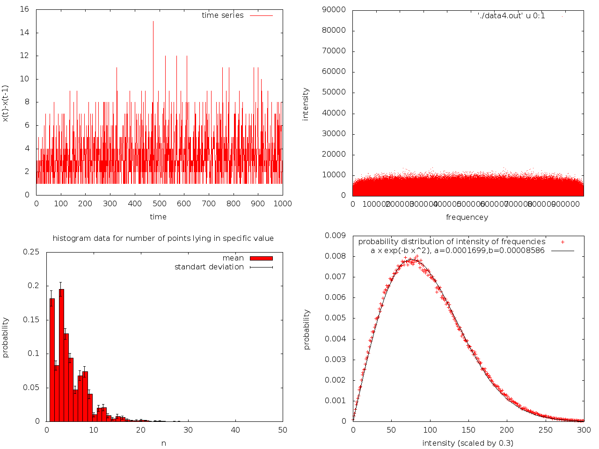
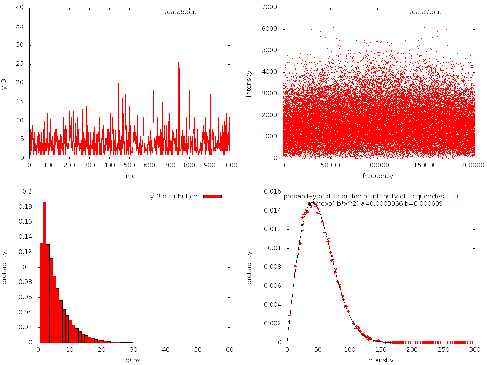
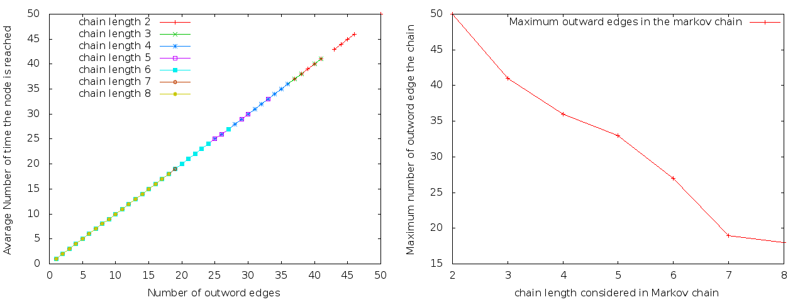

# 🔢 Statistical Time Series Analysis on the Sum of Two Squares

* **Domain:** Analytic Number Theory, Statistical Signal Processing & Markovian Entropy
* **Core Problem:** Investigating the stochastic properties, self-similarity, and deterministic predictability of a signal derived from numbers expressible as the sum of two squares ($n = a^2 + b^2$). By mapping number-theoretic intervals to a discrete time-series domain over 16 million time steps, the project evaluates whether prime-factor distribution constraints yield hidden predictive patterns or behave as pseudo-random Gaussian noise.

---

## 📈 Signal Generation Framework

Let $X$ represent the strictly increasing ordered sequence of integers that can be written as the sum of two squares:

$$X = \{0, 1, 2, 4, 5, 8, 9, 10, 13, 16, 17, 18, 20, 25, 26, 29, 32, 34, \dots\}$$

Because $X$ features a non-stationary increasing trend, we apply a first-difference transform to construct a stationary discrete-time gap signal, $y_t$:

$$y_t = x_t - x_{t-1}$$

$$y_t = \{1, 1, 2, 1, 3, 1, 1, 3, 3, 1, 1, 2, 5, 1, 3, 3, 2, \dots\}$$

### Signal Characteristics & Boundary Values
* **Logarithmic Scaling:** Analytical evaluation confirms that the maximum gap size grows logarithmically, $\max(y(t)) \sim \log(t)$. Over an empirical horizon of **16,649,376 time steps**, the maximum observed gap value remains bounded at just $63$.
* **Spectral Density:** Fast Fourier Transform (FFT) analysis of $y(t)$ reveals an intensity distribution closely tracking pure **Gaussian White Noise**, indicating a flat power spectral density that limits standard harmonic forecasting.

---

## 🌀 Non-Linear Transformations & Fractal Self-Similarity

To probe for deeper structural invariants, the primary sequence $y(t)$ is mapped to a binary state-space indicator sequence, $z_k(t)$, focused on specific gap magnitudes (e.g., $k = 3$):

$$z_k(t) = y_t==k $$

Extracting the secondary arrival intervals (the gaps between consecutive occurrences of state $k$) produces a lower-frequency recurrence signal, $y_k(t)$:

$$y_3(t) = \{3, 1, 6, 1, 4, 8, 1, 2, 7, 7, 2, 2, 4, 1, 11, 5, 9, 2, \dots\}$$

### Observations on Self-Similarity
Subjecting $y_k(t)$ to identical histogram and spectral density checks shows that the secondary gap distributions maintain statistical characteristics highly congruent to the parent sequence $y_t$. 
This persistent invariance under down-sampling and state-extraction strongly points to a **fractal, self-similar structure** embedded within the prime-factor lattice distributions.

---

## ⛓️ Markov Chain & Predictability Testing

To rigorously falsify the hypothesis that the sequence contains deterministic memory, we evaluate the conditional probability distribution across varying historical window horizons ($k$):

$$P(y_t \mid y_{t-1}, y_{t-2}, \dots, y_{t-k})$$

### Information Entropy Mapping
We construct a base-64 spatial hashing function to represent historical trajectories up to depth $k$:

$$p(t) = \sum_{i=0}^{k-1} 64^i \cdot y_{t-i}$$

The model checks for the existence of a deterministic transition function, $f$, such that $y_{t+1} = f(p(t))$, looking for a collapse of conditional entropy into a Dirac delta distribution.

* **High-Order Markov Evaluation:** Testing was scaled through deep memory depths ($k = 2$ up to $k = 8$) across the full $16.6\times10^6$ observation horizon.
* **Empirical Convergence:** The transition histograms show that given any fixed trajectory state $p(t)$, all valid subsequent values for $y_{t+1}$ are realized with roughly uniform probability. 

### Conclusion
The empirical evaluation strongly indicates that the gap sequence of the sum of two squares exhibits high-degree pseudo-randomness, making it an excellent candidate for a naturally occurring, non-deterministic mathematical noise signal.

[← Return to Main Project Index](./projects.html)
